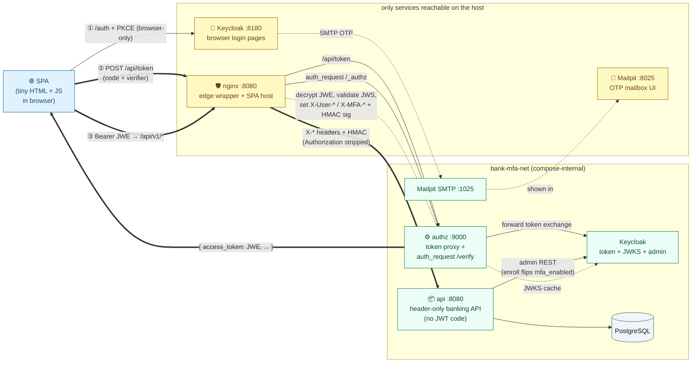
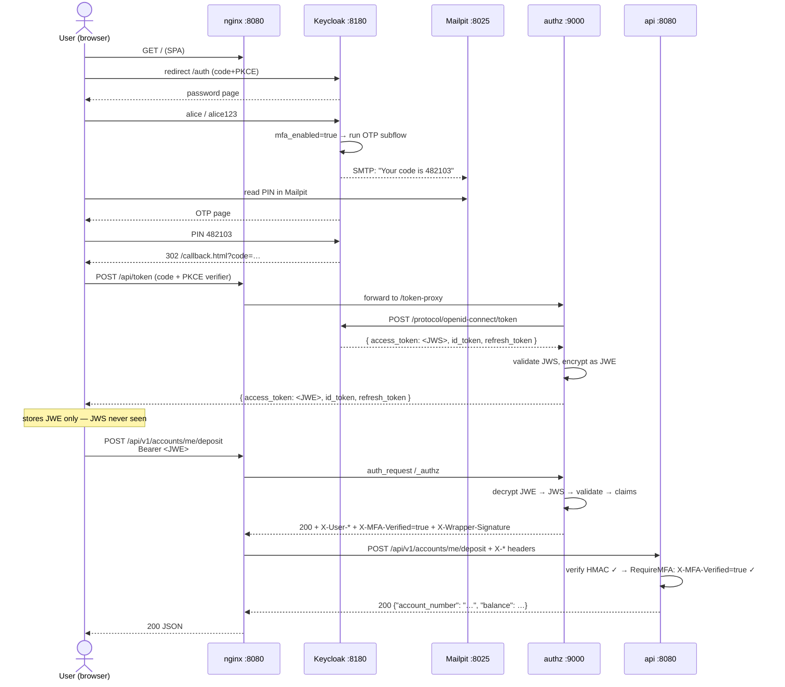
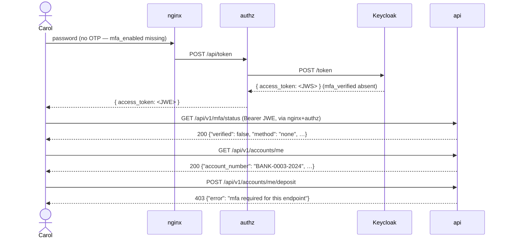
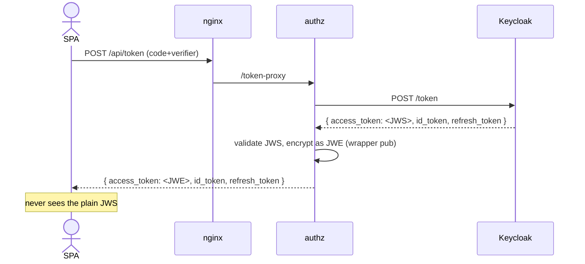

# 🛡️ Per-endpoint MFA validation · JWE bearer · header-only service

A Keycloak demo showing endpoint-level MFA enforcement, end-to-end JWE
bearer encryption, and a header-only handoff between the edge wrapper and
the service.

### Tech stack

| Layer | Technology |
| --- | --- |
| Identity provider | **Keycloak 26.6.2** ([changelog](https://www.keycloak.org/docs/latest/release_notes/index.html)) — custom image with the email-OTP SPI baked in (`kc.sh build` at image time). Pinned to `26.6.2` because the latest matching SPI build is `KC26.6.2`. |
| Email-OTP authenticator | [`mesutpiskin/keycloak-2fa-email-authenticator` v26.4.2](https://github.com/mesutpiskin/keycloak-2fa-email-authenticator/releases/tag/v26.4.2) — Apache-2.0 |
| Browser flow | OIDC auth-code + **PKCE** (`S256`) against a conditional `browser-mfa` realm flow |
| Token endpoint proxy | Go `authz` sidecar — forwards `/token` to Keycloak, wraps `access_token` as JWE in flight |
| Bearer crypto | **JWE** — RSA-OAEP key wrap + AES-256-GCM content encryption ([`lestrrat-go/jwx/v2 v2.1.6`](https://github.com/lestrrat-go/jwx)) |
| Edge wrapper | **nginx 1.29-alpine** — `auth_request /_authz`, claim-headers via `auth_request_set`, `proxy_pass http://api:8080` |
| Wrapper → service handoff | **HMAC-SHA256** over canonical `X-User-*` / `X-MFA-*` headers + `±30 s` timestamp |
| Service runtime | **Go 1.25**, standard `net/http`, [**`pgx v5.10.0`**](https://github.com/jackc/pgx) — zero JWT / JWE / JWKS code |
| MFA gate | `RequireMFA` middleware: passes if `X-MFA-Verified=true` *or* sub is in the in-memory step-up map |
| In-place enrollment | OTP via SMTP → **[Mailpit](https://github.com/axllent/mailpit) v1.30.1** SMTP catcher + Keycloak admin REST (`PUT users/<sub>`) |
| Database | **PostgreSQL 18-alpine**, `SELECT … FOR UPDATE` for balance integrity |
| Container base | **Alpine 3.21** for the Go services |
| SPA | hand-written HTML + JS — `sessionStorage` holds only the JWE; uses `<dialog>` for the MFA modal |

Three patterns wired together below — endpoint-tier MFA, JWE bearer, and
the dumb-service handoff:

### 🚪 Two security tiers per endpoint

Endpoints are split into trust levels. **Reads** (`/mfa/status`,
`/accounts/me`, `/accounts/me/transactions`) accept any valid session.
**Writes** (`/accounts/me/deposit`, `/accounts/me/withdraw`) require the
JWT to carry **`mfa_verified=true`** — otherwise the API returns **403**.
A no-MFA user can opt in *without re-login*: the SPA opens a modal, an
OTP lands in **Mailpit**, the user enters it, the API records a 30-min
step-up session and the failing request **replays on the same bearer**.

### 🔐 JWE-encrypted bearer end-to-end

Keycloak only signs access tokens — it can't encrypt them natively. The
wrapper's **`POST /api/token`** proxies every token exchange (auth-code
and refresh-token) to Keycloak, intercepts the response, replaces
`access_token` with a **JWE wrap**, and returns the encrypted form. The
plain Keycloak JWS exists only inside `authz`; the SPA only ever holds
and sends the JWE on the wire.

### 🧹 Wrapper does the crypto, service stays dumb

The API has **zero** JWT / JWE / JWKS / token-library code. The wrapper
(nginx + Go `authz` sidecar) decrypts the JWE, validates the inner JWS
against Keycloak's JWKS, and forwards parsed claims as **HMAC-signed
`X-User-*` / `X-MFA-*` headers**. The service reads headers, checks one
boolean (`MFAVerified`), runs business logic. That's the entire auth
contract between wrapper and service.

Sibling of [`../api-keycloak-security`](../api-keycloak-security), which
demonstrates the simpler case where Keycloak emits a token directly to
the API with no wrapper in between.

---

## Architecture



Only `nginx :8080`, `keycloak :8180` and `mailpit :8025` are published to the
host. Everything inside the `bank-mfa-net` box — including the API container —
is unreachable from outside. The Keycloak instance shown twice is the same
process; the split mirrors the *role* (browser-facing login pages vs.
machine-to-machine token + JWKS + admin endpoints).

**Three things make the wire safe end-to-end:**

1. The SPA's bearer is a **JWE** the moment it leaves Keycloak — the wrapper's
   `/token-proxy` swaps in the encrypted form before the response reaches the
   browser.
2. The wrapper decrypts and validates on every API call (`auth_request`) and
   forwards **only parsed claims as X-* headers** — the API has no JWT code.
3. Those headers are bound to an **HMAC + timestamp** the API verifies before
   reading them, so a peer inside `bank-mfa-net` can't forge identity.

### Secrets at runtime

| Material | Held by | Used for |
| --- | --- | --- |
| **Wrapper RSA keypair** (`AUTHZ_PRIVATE_KEY_BASE64`) | `authz` | Encrypts the JWS issued by Keycloak into a JWE in `/token-proxy`; decrypts the JWE coming back from the SPA in `/verify`. |
| **Wrapper HMAC secret** (`WRAPPER_HMAC_SECRET`) | `authz` + `api` | authz HMAC-signs the X-* identity headers it emits; the API rejects any request whose signature is missing, stale (±30 s), or wrong. Protects the API against direct calls or header spoofing. |

`make generate-keys` generates both at first `make up`.

### Login flow (MFA user)



### Login flow (no-MFA user)



The SPA pops a modal on that 403 → two-step enrollment → automatic replay.
See [In-place enrollment](#in-place-mfa-enrollment) below.

---

## Quick start

```bash
make doctor   # verify prerequisites (runtime, openssl, curl, free ports)
make up       # build images, generate secrets, start the whole stack
make login    # opens http://localhost:8080
make mail     # opens http://localhost:8025
make help     # see every available target with a one-line description
```

`make up` generates the wrapper RSA keypair and the HMAC secret on first run.

### Container runtime

The Makefile auto-detects **Docker** (`docker compose`) or **Podman** (`podman compose`
or `podman-compose`) and uses whichever it finds first. Override with:

```bash
make RUNTIME=podman COMPOSE='podman compose' up
```

`make doctor` prints which runtime + compose binary you ended up with.

### Three users to try

| User  | Password   | MFA at first login | Account         | Behavior |
| --- | --- | --- | --- | --- |
| alice | `alice123` | email OTP          | BANK-0001-2024  | full access (password + email PIN from Mailpit) |
| bob   | `bob123`   | email OTP          | BANK-0002-2024  | full access |
| carol | `carol123` | **none**           | BANK-0003-2024  | reads work; **writes 403 → modal → step-up → replay** |

`make reset-carol` wipes carol's runtime MFA state so you can demo the modal
flow again.

---

## Try it: three live scenarios

The first scenario shows the **happy path** through the wrapper. The other
two bypass nginx and hit the API container directly — once with a *valid*
HMAC and once after tampering — to demonstrate why the API can trust the
headers it sees.

### 🟢 Scenario 1 — call `/api/v1/accounts/me` with a real session

Log in at <http://localhost:8080> as carol, then in devtools:

```js
copy(sessionStorage.getItem("access_token"))   // 5-segment JWE
```

```bash
export TOKEN=…                                 # paste

curl -s -H "Authorization: Bearer $TOKEN" \
  http://localhost:8080/api/v1/accounts/me | python3 -m json.tool
```

```json
{
  "account_number": "BANK-0003-2024",
  "owner_name": "Carol NoMFA",
  "balance": 1500.0,
  "created_at": "..."
}
```

What happened: nginx ran `auth_request /_authz`, authz decrypted the JWE and
validated the JWS against the Keycloak JWKS, emitted the claim headers + HMAC
signature, nginx stripped the Authorization header and forwarded the X-*
headers, the API verified the HMAC and read carol's identity off the headers.

### 🟢 Scenario 2 — hit the API directly with a valid HMAC

Simulate a peer process inside the docker network that *has* the wrapper
secret. It can forge any identity it wants and the API will accept it. This
is what the HMAC alone protects: any attacker without the secret is locked
out. Anyone *with* it is "the wrapper" by definition — which is also why
production should move to SPIFFE mTLS.

```bash
make forge-valid USER=alice
```

What that target does (excerpt — see `Makefile`):

```bash
SECRET=$(grep ^WRAPPER_HMAC_SECRET= .env | cut -d= -f2)
TS=$(date +%s)

# Canonical string: lowercase header names, sorted, joined by \n
CANON=$(printf 'x-bank-account-number=BANK-0001-2024\n'
              'x-mfa-method=email\n'
              'x-mfa-verified=true\n'
              'x-user-email=alice@example.com\n'
              'x-user-roles=user\n'
              'x-user-sub=aaaaaaaa-bbbb-cccc-dddd-eeeeeeeeeeee\n'
              'x-user-username=alice\n'
              "x-wrapper-timestamp=$TS")

SIG=$(printf '%s' "$CANON" \
  | openssl dgst -sha256 -hmac "$SECRET" -binary \
  | openssl base64 | tr '+/' '-_' | tr -d '=\n')

# Call api:8080 directly via a one-shot container inside the compose network
docker run --rm --network bank-mfa-net curlimages/curl:latest \
  curl -s -H "X-User-Sub: aaaaaaaa-bbbb-cccc-dddd-eeeeeeeeeeee" \
       -H "X-User-Username: alice"  -H "X-User-Email: alice@example.com" \
       -H "X-User-Roles: user"      -H "X-Bank-Account-Number: BANK-0001-2024" \
       -H "X-MFA-Verified: true"    -H "X-MFA-Method: email" \
       -H "X-Wrapper-Timestamp: $TS" -H "X-Wrapper-Signature: $SIG" \
       http://api:8080/api/v1/accounts/me
```

```
HTTP 200 — {"account_number":"BANK-0001-2024","owner_name":"Alice Demo", …}
```

The API never asked who the caller was — it accepted the claim "I am alice"
because the HMAC matched. That's *expected* and is exactly the trust model
("if you have the secret, you're the wrapper"). In a real deployment the
secret never leaves the wrapper, so peer processes can't reproduce this.

### 🔴 Scenario 3 — same valid signature, then tamper with one header

Compute the signature for alice, but change `X-User-Roles` to `admin` before
sending. The API recomputes the HMAC over the headers it *actually received*
and the signatures don't match.

```bash
make forge-tampered USER=alice TAMPER=X-User-Roles=admin
```

```
HTTP 401 — {"error":"untrusted upstream","detail":"wrapper signature mismatch"}
```

In the API container's log:

```
reject untrusted upstream: wrapper signature mismatch (path=/api/v1/accounts/me)
```

Try the same trick on **any** header — `X-User-Sub`, `X-Bank-Account-Number`,
`X-MFA-Verified`, even `X-Wrapper-Timestamp` — and the result is identical.
The HMAC is computed over every signed field so tampering with one line of
the canonical string changes the whole output.

You can also try the **replay** angle: take a real valid signature from
yesterday and send it today. The `±30 s` clock skew window kicks in:

```
HTTP 401 — {"error":"untrusted upstream","detail":"wrapper signature outside time window"}
```

Together, the three scenarios bound the trust model: **the wrapper headers
prove either authenticity-and-integrity or nothing**. The API never has to
look at a token.

---

## What's in the JWT

The JWS *inside* the JWE carries Keycloak's standard claims plus the demo's
mappers. For alice after the OTP step:

```json
{
  "exp": 1717612345,
  "iss": "http://localhost:8180/realms/banking-mfa",
  "sub": "5b8e…",
  "preferred_username": "alice",
  "email": "alice@example.com",
  "realm_access":  { "roles": ["user", "default-roles-banking-mfa", "offline_access"] },
  "bank_account_number": "BANK-0001-2024",
  "mfa_verified": true,
  "mfa_method": "email"
}
```

For carol, `mfa_verified` and `mfa_method` are **absent** entirely — the
usermodel-attribute mappers don't emit anything for users without the
underlying attribute. The API reads a missing claim as `false`.

`mfa_verified` is mapped from the **user attribute `mfa_enabled`** (jsonType
`boolean`). The same attribute drives the `conditional-user-attribute`
authenticator that decides whether the OTP subflow runs. One attribute,
two effects — a user only ends up with `mfa_verified=true` in their token
if they actually went through the OTP step.

The SPA never sees this JWS directly; it lives only inside the JWE.

---

## The wrapper — two endpoints

```nginx
# nginx/nginx.conf (excerpt)

# Token endpoint: SPA never talks to Keycloak directly.
location = /api/token {
    proxy_pass http://authz:9000/token-proxy;
}

# All identity-bearing API calls. auth_request reaches authz, which validates
# the JWE bearer and writes the parsed claims into response headers.
location /api/ {
    auth_request /_authz;
    auth_request_set $user_sub      $upstream_http_x_user_sub;
    auth_request_set $user_roles    $upstream_http_x_user_roles;
    auth_request_set $mfa_verified  $upstream_http_x_mfa_verified;
    auth_request_set $wrap_sig      $upstream_http_x_wrapper_signature;
    auth_request_set $wrap_ts       $upstream_http_x_wrapper_timestamp;
    # …all other X-* headers…

    proxy_set_header Authorization "";          # bearer stripped
    proxy_set_header X-User-Sub          $user_sub;
    proxy_set_header X-User-Roles        $user_roles;
    proxy_set_header X-MFA-Verified      $mfa_verified;
    proxy_set_header X-Wrapper-Signature $wrap_sig;
    proxy_set_header X-Wrapper-Timestamp $wrap_ts;
    proxy_pass http://api:8080;
}

location = /_authz {
    internal;
    proxy_pass http://authz:9000/verify;
    proxy_pass_request_body off;
    proxy_set_header Authorization $http_authorization;
}
```

The mechanic is `auth_request_set` — nginx normally only looks at the
**status code** of the sub-request, but `auth_request_set` copies a
**response header** of the sub-request into an nginx variable, available for
the upstream call.

```go
// authz/cmd/server/main.go (excerpt)

// /token-proxy
resp, _ := keycloak.Do(forwardedForm)         // forward to KC token endpoint
payload := jsonUnmarshal(resp.Body)
jws := payload["access_token"].(string)
jwsutil.Validate(ctx, cache, issuer, jws)     // defense in depth
payload["access_token"] = wrapperKey.Encrypt(jws) // JWS → JWE
return payload                                 // → SPA

// /verify (auth_request)
plain, _   := wrapperKey.Decrypt([]byte(tokenStr))       // JWE → JWS
res, _     := jwsutil.Validate(ctx, cache, issuer, plain) // verify signature, claims
w.Header().Set("X-User-Sub",   res.Sub)
w.Header().Set("X-User-Roles", strings.Join(res.RealmRoles, ","))
w.Header().Set("X-MFA-Verified", boolString(res.MFAVerified))
// …
w.Header().Set("X-Wrapper-Timestamp", strconv.FormatInt(time.Now().Unix(), 10))
w.Header().Set("X-Wrapper-Signature", wrapsig.Sign(w.Header().Get, hmacSecret))
```

If anything fails (missing/bad JWE, bad signature, bad issuer, expired) authz
returns `401` and nginx propagates that back to the client. The API is never
called.

**MFA is not enforced in the wrapper.** Carol's token is also valid — it just
lacks `mfa_verified`. The MFA check is applied at the API layer, per route,
so non-MFA users can still reach `/api/v1/accounts/me` and the enrollment
endpoints.

---

## Endpoints

All routes reach the API through `http://localhost:8080/api/*` (nginx). None
are published directly; the API container has no host port.

| Method | Path                                | Guard | Behaviour |
| --- | --- | --- | --- |
| `POST` | `/api/token`                        | —                                  | Wrapper token proxy (auth-code + refresh-token grants) |
| `GET`  | `/api/v1/mfa/status`                | bearer                              | `{verified, method, sub, email}` |
| `POST` | `/api/v1/mfa/enroll/start`          | bearer                              | `{email}` — mail OTP via Mailpit, cache code by `sub` |
| `POST` | `/api/v1/mfa/enroll/verify`         | bearer                              | `{code}` — record step-up session, flip Keycloak attribute |
| `GET`  | `/api/v1/accounts/me`               | bearer                              | Caller's bank account |
| `GET`  | `/api/v1/accounts/me/transactions`  | bearer                              | Transaction history |
| `POST` | `/api/v1/accounts/me/deposit`       | bearer + **`mfa_verified` or step-up** | `{amount: <n>}` |
| `POST` | `/api/v1/accounts/me/withdraw`      | bearer + **`mfa_verified` or step-up** | `{amount: <n>}` |

"bearer" means the client sends `Authorization: Bearer <JWE>`; the wrapper
decrypts, validates, and forwards claims as X-* headers. "step-up" means the
caller completed `enroll/verify` in the last 30 minutes.

---

## In-place MFA enrollment

The flow that makes carol useful:

```
GET  /api/v1/accounts/me               → 200  (no MFA needed)
POST /api/v1/accounts/me/deposit       → 403  {"error":"mfa required for this endpoint",
                                                "hint":"enroll an OTP via POST /api/v1/mfa/enroll/start"}

POST /api/v1/mfa/enroll/start  {email} → 200  code mailed to Mailpit (5-min TTL)
POST /api/v1/mfa/enroll/verify {code}  → 200  {"status":"mfa_verified",
                                                "step_up_verified_until":"…+30m"}

POST /api/v1/accounts/me/deposit       → 200  same JWE, no re-login
```

The verify endpoint does two things:

1. **Server-side step-up session** — records the caller's `sub` in an
   in-memory map for 30 minutes. `RequireMFA` checks it as a fallback when
   the JWT's `mfa_verified` claim is absent. This is what makes the *current*
   token work immediately.
2. **Keycloak user attribute** — calls the Keycloak admin REST API to set
   `mfa_enabled=true` and clears the user cache. Next login uses the OTP
   subflow and the new token actually carries `mfa_verified=true` in the JWS.

After enrollment the SPA also runs a refresh-token grant via `/api/token`, so
the bearer in `sessionStorage` immediately picks up the new claim instead of
relying on the step-up fallback.

---

## Logout

The SPA's **Logout** button calls Keycloak's RP-initiated end-session
endpoint:

```
GET /realms/banking-mfa/protocol/openid-connect/logout
    ?client_id=banking-spa
    &post_logout_redirect_uri=http://localhost:8080/
    &id_token_hint=<id_token>
```

That clears the Keycloak browser cookie so the next login does **not**
silently reuse the existing session — important when switching between
alice / bob / carol during the demo. `sessionStorage` is wiped on the SPA
side first.

If the local `id_token` is expired or signed by a key Keycloak no longer
has (e.g. after a `make clean`), the SPA omits `id_token_hint` to avoid the
"Invalid parameter: id_token_hint" Keycloak error page.

---

## How conditional email-OTP is wired in Keycloak

The SPI is the open-source [mesutpiskin/keycloak-2fa-email-authenticator](https://github.com/mesutpiskin/keycloak-2fa-email-authenticator)
(Apache-2.0). The JAR is downloaded by `keycloak/Dockerfile` at image build
time; `kc.sh build` runs to register it.

Realm wiring (`keycloak/realm-export.json`, abridged):

```jsonc
{
  "smtpServer": { "host": "mailpit", "port": "1025", "from": "banking@localhost",
                  "auth": "false", "ssl": "false", "starttls": "false" },

  "authenticationFlows": [
    {
      "alias": "browser-mfa",
      "authenticationExecutions": [
        { "authenticator": "auth-cookie",                  "requirement": "ALTERNATIVE" },
        { "authenticator": "identity-provider-redirector", "requirement": "ALTERNATIVE" },
        { "flowAlias": "browser-mfa forms",                "requirement": "ALTERNATIVE",
          "authenticatorFlow": true }
      ]
    },
    {
      "alias": "browser-mfa forms",
      "authenticationExecutions": [
        { "authenticator": "auth-username-password-form", "requirement": "REQUIRED" },
        { "flowAlias": "browser-mfa otp",                 "requirement": "CONDITIONAL",
          "authenticatorFlow": true }
      ]
    },
    {
      "alias": "browser-mfa otp",
      "authenticationExecutions": [
        { "authenticator": "conditional-user-attribute",  "requirement": "REQUIRED",
          "authenticatorConfig": "mfa-on-attribute" },
        { "authenticator": "email-authenticator",         "requirement": "REQUIRED",
          "authenticatorConfig": "email-otp-config" }
      ]
    }
  ],
  "authenticatorConfig": [
    { "alias": "email-otp-config",  "config": { "length": "6", "ttl": "300" } },
    { "alias": "mfa-on-attribute",  "config": { "attribute_name": "mfa_enabled",
                                                "attribute_expected_value": "true",
                                                "not": "false" } }
  ],
  "browserFlow": "browser-mfa"
}
```

Two key ideas:

- **`browser-mfa otp` runs only if `mfa_enabled=true`.** It is `CONDITIONAL`
  at the parent level, and its first execution is the
  `conditional-user-attribute` authenticator. If the attribute is missing or
  not `true`, the whole subflow is treated as a no-op — Keycloak proceeds
  straight to token issuance.
- **`mfa_verified` is a usermodel-attribute claim**, not a hardcoded one.
  The claim is emitted from the same `mfa_enabled` attribute that drives the
  conditional flow. Users who never go through the OTP step never have the
  attribute, never have the claim, and `RequireMFA` rejects them.

### Why the SPA goes through `/api/token` instead of Keycloak directly

Keycloak has client attributes named `access.token.encrypted.response.alg` /
`access.token.encrypted.response.enc`. They look right but they are **not
honored for access tokens** — Keycloak's `TokenManager` always calls
`session.tokens().encode()` (plain JWS) for access tokens; only id-tokens
take the `encodeAndEncrypt()` path. Setting those attributes does nothing.

The demo works around that with a **`POST /api/token`** endpoint on the
wrapper. The SPA POSTs the OIDC token-endpoint form here (auth-code + PKCE
verifier for the initial exchange, refresh_token for renewals). The wrapper
forwards to Keycloak's real `/token` endpoint, parses the response, replaces
`access_token` with its JWE wrap, and returns the modified JSON. The plain
Keycloak JWS exists only inside the authz container; the SPA only ever sees
the JWE form.



---

## Differences vs. [`api-keycloak-security`](../api-keycloak-security)

| Aspect              | `api-keycloak-security`             | `api-keycloak-mfa-email` (this) |
| --- | --- | --- |
| Authentication      | ROPC (`grant_type=password`)        | Browser auth-code + PKCE via wrapper token proxy |
| Second factor       | none                                | conditional email OTP via mesutpiskin SPI |
| Token endpoint      | Keycloak directly                   | `/api/token` on the wrapper — wraps the response |
| Bearer on the wire  | **JWE for API**                     | **JWE for wrapper** — re-wrapped on issue |
| Wrapper             | none — API is directly exposed      | nginx + Go `auth_request` sidecar |
| API token handling  | API decrypts JWE itself             | API has zero JWT/JWE code; reads X-* claim headers signed by HMAC |
| MFA enforcement     | n/a                                 | per-endpoint at API via `RequireMFA` |
| Step-up enrollment  | n/a                                 | in-place OTP via `enroll/start` + `enroll/verify` — no re-login |
| API on host         | yes (`:8081`)                       | no — only through nginx `:8080` |
| Multiple users      | alice / bob                         | alice / bob (MFA) + carol (no MFA, can enrol) |

The API in this demo is intentionally simpler than the original: no token
library at all. The wrapper carries all the JWT/JWE/Keycloak complexity.

---

## Going production-ready

The wrapper signs the X-* identity headers it forwards to the API with an
HMAC under a shared `WRAPPER_HMAC_SECRET`. That's enough to keep the demo
honest, but for a real deployment replace it with **SPIFFE mTLS via SPIRE**:
nginx and the API both receive short-lived X.509 SVIDs with URI SANs like
`spiffe://banking.local/{nginx,api}`; the API's HTTPS listener only completes
the handshake when the client SAN matches the expected SPIFFE ID. No shared
secret, identity rotates automatically, and the API can prove it's
specifically the nginx workload calling it — not just *someone* with the
HMAC key.

