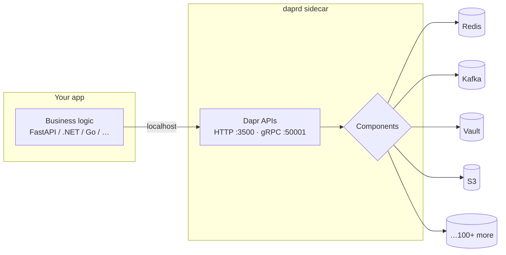
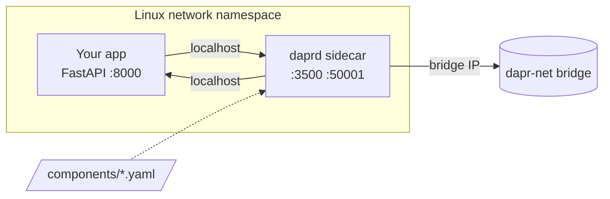

# Dapr Examples — Local Docker Compose

Four runnable examples that demonstrate the core [Dapr](https://dapr.io) building blocks on a laptop. Each example boots in seconds, exposes a tiny FastAPI surface, and shows one Dapr concept end-to-end — no Kubernetes, no cloud, no broker setup beyond `docker compose up`.

## Why Dapr matters

Distributed systems repeat the same plumbing problems: service discovery, retries, state persistence, message brokers, secrets, observability, scheduled jobs. Every team rebuilds them, every cloud has a different SDK, every swap of broker or database means rewriting application code.

**Dapr** ([Distributed Application Runtime](https://dapr.io)) — a CNCF graduated project — solves this by running a **sidecar process** next to each service. The app speaks plain HTTP or gRPC to its sidecar; the sidecar handles the distributed concern through a swappable **component**:

- Talk to `state` — Dapr writes to Redis, Postgres, Cosmos DB, DynamoDB, etcd, …
- Talk to `pubsub` — Dapr publishes to Redis, Kafka, RabbitMQ, NATS, SNS/SQS, …
- Talk to `secretstore` — Dapr reads from a file, Kubernetes secrets, Vault, KeyVault, AWS Secrets Manager, …
- Talk to `bindings` — Dapr subscribes to cron, S3, Kafka, SMTP, HTTP, Twilio, …

Same app code, different YAML. That's the value proposition: **portable distributed primitives** with one consistent API across more than 100 components, language-agnostic, runtime-agnostic.



These examples are the smallest possible demonstrations of that idea. Each example uses the simplest backend (Redis or a local file) so you can focus on **how the app talks to Dapr**, not how to operate the backend.

## The four examples

| Example | Building block | What it shows | README |
|---|---|---|---|
| [`service-invocation/`](./service-invocation/README.md) | Service invocation | Service A calls Service B by **app-id**, no host/port. Discovery via Dapr's mDNS, transparent retries, mTLS-capable. | [→ details](./service-invocation/README.md) |
| [`state-management/`](./state-management/README.md) | State store | Writer/reader share a **Redis-backed key-value store** through Dapr. Demonstrates `keyPrefix: none` for shared keyspace. | [→ details](./state-management/README.md) |
| [`pubsub/`](./pubsub/README.md) | Publish / subscribe | Publisher fires events into a topic; subscriber receives them wrapped in a **CloudEvent envelope**. Programmatic subscription model. | [→ details](./pubsub/README.md) |
| [`bindings-secrets/`](./bindings-secrets/README.md) | Input bindings + secret store | **Cron** triggers a handler every 10 s without app-side polling; another service reads **secrets** from a local file store via the same API a Vault or KMS would expose. | [→ details](./bindings-secrets/README.md) |

Each sub-README contains: a mermaid sequence + topology diagram, the component YAML, the wired Python snippets, and 5–6 example `curl` calls.

## Prerequisites

- Docker + Docker Compose v2
- `make`, `curl`, optionally `jq`

## Stack

| Component       | Version       |
|-----------------|---------------|
| Dapr runtime    | **1.17.7** (`daprio/daprd`, `daprio/dapr`) |
| Dapr Python SDK | **≥1.17**     |
| Python base     | **3.14-slim** |
| FastAPI         | **≥0.136**    |
| uvicorn         | **≥0.48**     |
| Redis           | **8-alpine**  |
| Dependency mgmt | **uv** (installed in image) |

## Layout

```
.
├── Makefile                        all docker compose targets
├── service-invocation/
│   ├── README.md
│   ├── docker-compose.yml
│   ├── components/
│   ├── service-a/   (caller)
│   └── service-b/   (callee)
├── state-management/
│   ├── README.md
│   ├── docker-compose.yml
│   ├── components/statestore.yaml
│   ├── writer/
│   └── reader/
├── pubsub/
│   ├── README.md
│   ├── docker-compose.yml
│   ├── components/pubsub.yaml
│   ├── publisher/
│   └── subscriber/
└── bindings-secrets/
    ├── README.md
    ├── docker-compose.yml
    ├── components/
    │   ├── cron.yaml
    │   ├── secretstore.yaml
    │   └── secrets.json    (demo only)
    ├── scheduler/
    └── handler/
```

## Usage

Run one example at a time (they reuse host ports `8001`/`8002` for the two services so port collisions are easy to spot):

```bash
make up-service-invocation        # build + start
make test-service-invocation      # curl demo endpoint
make logs-service-invocation      # follow sidecar + app logs
make down-service-invocation      # stop + remove volumes
```

Same pattern for `state-management`, `pubsub`, `bindings-secrets`. Run `make help` to see all targets, including `up-all` / `down-all` and `clean`.

## How a service + sidecar pair works (applies to all examples)

Each Python app shares a Linux network namespace with its own `daprd` container via Compose's `network_mode: "service:<app>"`. From the app's perspective the sidecar is on `localhost:3500` (HTTP API) and `localhost:50001` (gRPC API). The sidecar reverse-invokes the app on `localhost:8000`. Components are mounted from each example's `./components` directory.



## Where to go next

- Dapr docs: <https://docs.dapr.io>
- Components reference: <https://docs.dapr.io/reference/components-reference/>
- Python SDK: <https://github.com/dapr/python-sdk>
- Dapr Quickstarts (Kubernetes + multi-language): <https://github.com/dapr/quickstarts>

The natural next step after these examples is **running the same components on Kubernetes** — the app code does not change; you replace `docker-compose.yml` with a Dapr Helm install plus the same component YAMLs as `Component` CRs.
