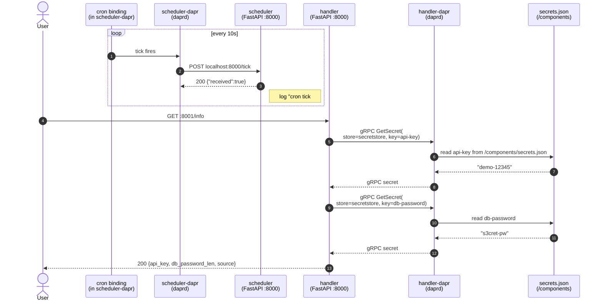
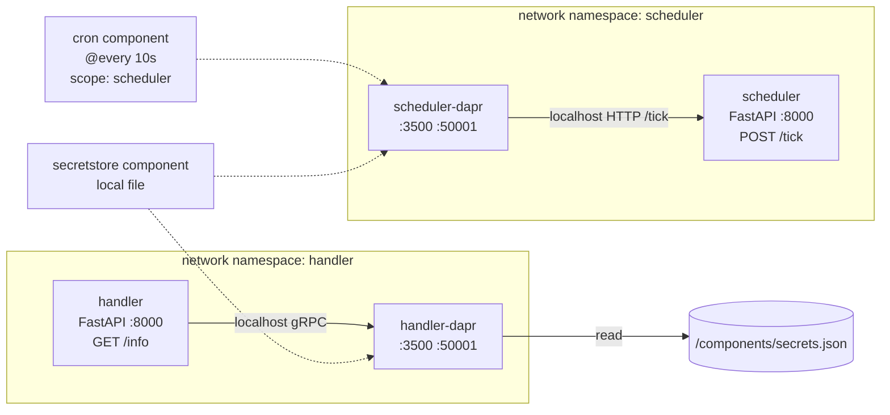

# Bindings + Secrets

Demonstrates two Dapr building blocks in one example:

1. **Input binding** — a `cron` component triggers the `scheduler` app every 10 seconds without the app polling or owning any scheduling logic. Swap the component to `bindings.kafka`, `bindings.aws.sqs`, `bindings.http`, etc. and the app stays the same — it just keeps receiving `POST /<binding-name>` calls.
2. **Secret store** — the `handler` app reads `api-key` and `db-password` from a Dapr secret store. The component points to a local JSON file here; swap it to `secretstores.kubernetes`, `secretstores.hashicorp.vault`, `secretstores.azure.keyvault`, etc. and the app code stays the same.

## What's running

| Container          | Role                                                 | Host port |
|--------------------|------------------------------------------------------|-----------|
| `handler`          | FastAPI handler — reads secrets (Python + uv)        | `8001`    |
| `handler-dapr`     | Dapr sidecar for handler (loads `secretstore`)       | —         |
| `scheduler`        | FastAPI scheduler — receives cron ticks (Python + uv)| `8002`    |
| `scheduler-dapr`   | Dapr sidecar for scheduler (loads `tick` + `secretstore`) | —    |
| `placement`        | Dapr placement service (parity)                      | —         |

No external broker — both components are entirely local to the sidecar.

## Component scoping

Three component files in `components/` are mounted into **both** sidecars, but the cron input binding must only fire against the `scheduler` app — otherwise the `handler` sidecar would also try `POST /tick` on an endpoint that doesn't exist.

`cron.yaml` uses `scopes:` to restrict the component to one app-id:

```yaml
scopes:
  - scheduler
```

`secretstore.yaml` is unscoped, so both sidecars load it. Only `handler` calls `GetSecret`.

## Flow





## Components

`components/cron.yaml`
```yaml
apiVersion: dapr.io/v1alpha1
kind: Component
metadata:
  name: tick                    # binding name == POST route on app
spec:
  type: bindings.cron
  version: v1
  metadata:
    - name: schedule
      value: "@every 10s"
    - name: direction
      value: "input"
scopes:
  - scheduler                   # only scheduler's sidecar fires this
```

`components/secretstore.yaml`
```yaml
apiVersion: dapr.io/v1alpha1
kind: Component
metadata:
  name: secretstore
spec:
  type: secretstores.local.file
  version: v1
  metadata:
    - name: secretsFile
      value: /components/secrets.json
    - name: nestedSeparator
      value: ":"
```

`components/secrets.json` (demo only — never commit real secrets)
```json
{
  "api-key": "demo-12345",
  "db-password": "s3cret-pw"
}
```

## How the calls are wired

`scheduler` (file: `scheduler/app.py`) — binding `tick` becomes route `POST /tick`:
```python
@app.post("/tick")
def tick():
    state["ticks"] += 1
    log.info("cron tick #%d at %s", state["ticks"], state["last"])
    return {"received": True}
```

`handler` (file: `handler/app.py`) — fetch secrets via SDK:
```python
with DaprClient() as client:
    api_key = client.get_secret("secretstore", "api-key").secret["api-key"]
    db_pw = client.get_secret("secretstore", "db-password").secret["db-password"]
```

## Run it

```bash
make up-bindings-secrets        # build + start (handler, scheduler, 2 sidecars, placement)
make test-bindings-secrets      # GET /info on handler
make logs-bindings-secrets      # watch cron ticks + handler activity
make down-bindings-secrets
```

## Example calls

### Secret store

Fetch the API key + db-password length via the handler:
```bash
curl -s localhost:8001/info | jq
```
```json
{
  "api_key": "demo-12345",
  "db_password_len": 9,
  "source": "dapr secret store 'secretstore'"
}
```

Call the sidecar's HTTP secret API directly (from inside the handler container):
```bash
docker compose -f bindings-secrets/docker-compose.yml exec handler \
  curl -s http://localhost:3500/v1.0/secrets/secretstore/api-key
```
```json
{"api-key":"demo-12345"}
```

List all secret keys via the bulk endpoint:
```bash
docker compose -f bindings-secrets/docker-compose.yml exec handler \
  curl -s http://localhost:3500/v1.0/secrets/secretstore/bulk
```
```json
{
  "api-key": {"api-key": "demo-12345"},
  "db-password": {"db-password": "s3cret-pw"}
}
```

Rotate a secret without rebuilding: edit `components/secrets.json`, then:
```bash
docker compose -f bindings-secrets/docker-compose.yml restart handler-dapr
curl -s localhost:8001/info | jq
```
The `local.file` secret store re-reads on sidecar start; some store types support hot reload, this one does not.

### Cron input binding

Watch ticks arrive every 10 seconds:
```bash
docker compose -f bindings-secrets/docker-compose.yml logs -f --since=1s scheduler
```
```
scheduler-1  | 2026-05-24 12:34:56,000 INFO cron tick #1 at 2026-05-24T12:34:56+00:00
scheduler-1  | 2026-05-24 12:35:06,001 INFO cron tick #2 at 2026-05-24T12:35:06+00:00
scheduler-1  | 2026-05-24 12:35:16,003 INFO cron tick #3 at 2026-05-24T12:35:16+00:00
```

Read the scheduler's tick counter (app-internal state, not via Dapr):
```bash
curl -s localhost:8002/status | jq
```
```json
{"ticks":3,"last":"2026-05-24T12:35:16+00:00"}
```

Manually fire the binding handler (bypasses cron, simulates an event):
```bash
curl -s -X POST localhost:8002/tick | jq
```
```json
{"received":true}
```

Confirm the binding is scoped — handler's sidecar must **not** load `tick`:
```bash
docker compose -f bindings-secrets/docker-compose.yml logs handler-dapr | grep -i 'component.*tick'
docker compose -f bindings-secrets/docker-compose.yml logs scheduler-dapr | grep -i 'component.*tick'
```
Only the scheduler log should show the `tick` component being initialized.

Health endpoints:
```bash
curl -s localhost:8001/healthz
curl -s localhost:8002/healthz
```

## Troubleshooting

- **`/info` returns 502 secret fetch failed** — secret store not loaded. Confirm `docker compose -f bindings-secrets/docker-compose.yml logs handler-dapr | grep secretstore` shows `component loaded`. Verify the secret name matches a top-level key in `secrets.json`.
- **No cron ticks in scheduler logs** — confirm scope and schedule: `docker compose -f bindings-secrets/docker-compose.yml logs scheduler-dapr | grep -i cron`. The component name `tick` must match the route `POST /tick` on the app.
- **Handler logs `POST /tick` 404s** — the `scopes:` field was removed from `cron.yaml`, so both sidecars fired the binding. Re-add `scopes: [scheduler]` and restart.
- **Secret value didn't update after editing `secrets.json`** — `local.file` store is read at sidecar start. Restart `handler-dapr` to pick up changes.
- **Port already allocated** — `8001`/`8002` collide with another running example. Run one example at a time.

## Security note

The example commits `secrets.json` to demonstrate the API. In any real setup:
- Never commit `secrets.json` (add to `.gitignore`)
- Use a real secret store (`secretstores.kubernetes`, `secretstores.hashicorp.vault`, cloud KMS, etc.)
- Restrict `GetSecret` access with Dapr **secret scope** policies in the Configuration resource
