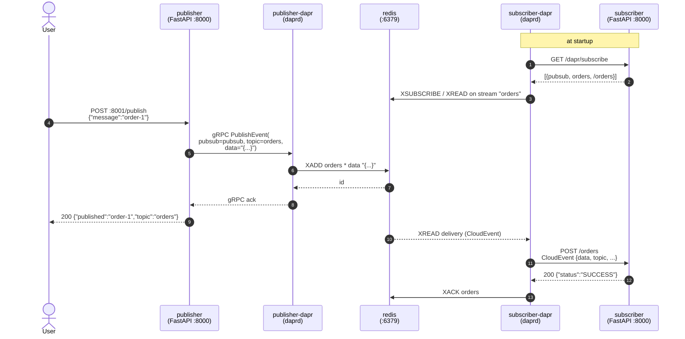
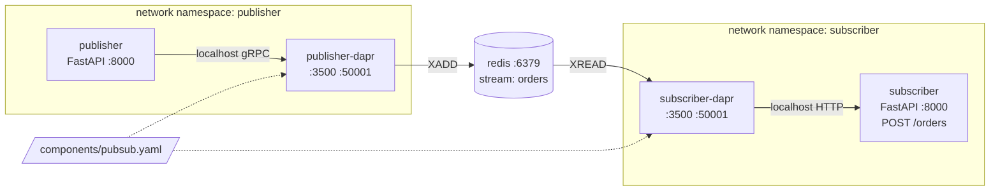

# Pub/Sub

Demonstrates the Dapr **publish/subscribe** building block: a publisher fires events into a topic and a subscriber receives them, decoupled through Dapr. The app code knows about a `pubsub` component name and a `orders` topic — it does not know that the broker is Redis. Swap the component to `pubsub.kafka`, `pubsub.rabbitmq`, `pubsub.aws.snssqs`, etc. and the app code stays the same.

## What's running

| Container          | Role                                       | Host port |
|--------------------|--------------------------------------------|-----------|
| `publisher`        | FastAPI publisher (Python + uv)            | `8001`    |
| `publisher-dapr`   | Dapr sidecar for publisher                 | —         |
| `subscriber`       | FastAPI subscriber (Python + uv)           | `8002`    |
| `subscriber-dapr`  | Dapr sidecar for subscriber                | —         |
| `redis`            | Redis 8 (pub/sub broker)                   | —         |
| `placement`        | Dapr placement service (parity)            | —         |

Component `pubsub` (`components/pubsub.yaml`) wires `pubsub.redis` to `redis:6379`. Topic name is `orders`.

## Programmatic subscription

This example uses the **programmatic subscription model**: the subscriber app exposes `GET /dapr/subscribe`, and at startup the Dapr sidecar polls that endpoint to learn which topics to subscribe to and which route should receive messages.

```python
@app.get("/dapr/subscribe")
def subscribe():
    return [{"pubsubname": "pubsub", "topic": "orders", "route": "/orders"}]
```

The sidecar then subscribes to Redis on the app's behalf. When a message arrives, the sidecar wraps it in a **CloudEvent envelope** and POSTs it to `/orders` on the subscriber app. The app's response controls redelivery (`{"status": "SUCCESS"}` acks; `RETRY` re-queues; `DROP` discards).

Alternative (not used here): declarative subscriptions via a `Subscription` resource YAML in `./components` — no app endpoint needed, but the app must still expose the route handler.

## Flow





## Component (`components/pubsub.yaml`)

```yaml
apiVersion: dapr.io/v1alpha1
kind: Component
metadata:
  name: pubsub
spec:
  type: pubsub.redis
  version: v1
  metadata:
    - name: redisHost
      value: redis:6379
    - name: redisPassword
      value: ""
```

## How the calls are wired

`publisher` (file: `publisher/app.py`)
```python
with DaprClient() as client:
    client.publish_event(
        pubsub_name="pubsub",
        topic_name="orders",
        data=json.dumps(payload.model_dump()),
        data_content_type="application/json",
    )
```

`subscriber` (file: `subscriber/app.py`)
```python
@app.get("/dapr/subscribe")
def subscribe():
    return [{"pubsubname": "pubsub", "topic": "orders", "route": "/orders"}]

@app.post("/orders")
async def handle(request: Request):
    envelope = await request.json()      # CloudEvent envelope
    log.info("received topic=%s data=%s", envelope["topic"], envelope["data"])
    return {"status": "SUCCESS"}
```

## Run it

```bash
make up-pubsub          # build + start (publisher, subscriber, redis, placement, 2 sidecars)
make test-pubsub        # publishes one message
make logs-pubsub        # watch the subscriber receive it
make down-pubsub
```

## Example calls

Publish a single message:
```bash
curl -s -X POST localhost:8001/publish \
  -H 'content-type: application/json' \
  -d '{"message":"order-1"}' | jq
```
```json
{"published":"order-1","topic":"orders"}
```

Watch the subscriber receive it:
```bash
docker compose -f pubsub/docker-compose.yml logs --since=10s subscriber
```
```
subscriber-1  | 2026-05-24 12:34:56,789 INFO received topic=orders data={'message': 'order-1'}
```

Publish a burst:
```bash
for i in 1 2 3 4 5; do
  curl -s -X POST localhost:8001/publish \
    -H 'content-type: application/json' \
    -d "{\"message\":\"order-$i\"}"
  echo
done
docker compose -f pubsub/docker-compose.yml logs --since=5s subscriber
```
```
subscriber-1  | ... received topic=orders data={'message': 'order-1'}
subscriber-1  | ... received topic=orders data={'message': 'order-2'}
subscriber-1  | ... received topic=orders data={'message': 'order-3'}
subscriber-1  | ... received topic=orders data={'message': 'order-4'}
subscriber-1  | ... received topic=orders data={'message': 'order-5'}
```

Inspect the subscription the sidecar fetched from the app:
```bash
curl -s localhost:8002/dapr/subscribe | jq
```
```json
[
  {
    "pubsubname": "pubsub",
    "topic": "orders",
    "route": "/orders"
  }
]
```

Publish via the sidecar's HTTP API directly (no SDK):
```bash
docker compose -f pubsub/docker-compose.yml exec publisher \
  curl -s -X POST \
  http://localhost:3500/v1.0/publish/pubsub/orders \
  -H 'content-type: application/json' \
  -d '{"message":"via http api"}'
docker compose -f pubsub/docker-compose.yml logs --since=5s subscriber
```

Peek at the underlying Redis stream:
```bash
docker compose -f pubsub/docker-compose.yml exec redis \
  redis-cli XLEN orders
docker compose -f pubsub/docker-compose.yml exec redis \
  redis-cli XRANGE orders - + COUNT 3
```

Health endpoints:
```bash
curl -s localhost:8001/healthz
curl -s localhost:8002/healthz
```

## CloudEvent envelope

Every message reaches the subscriber wrapped in a CloudEvent. The handler receives JSON like:
```json
{
  "specversion": "1.0",
  "type": "com.dapr.event.sent",
  "source": "publisher",
  "id": "abcd-...",
  "time": "2026-05-24T12:34:56Z",
  "datacontenttype": "application/json",
  "pubsubname": "pubsub",
  "topic": "orders",
  "traceid": "00-...",
  "data": {"message": "order-1"}
}
```
Access the payload at `envelope["data"]`.

## Troubleshooting

- **Subscriber logs nothing after publish** — confirm the subscription was registered: `docker compose -f pubsub/docker-compose.yml logs subscriber-dapr | grep -i subscrib`. The sidecar must have called `/dapr/subscribe` on the app at startup.
- **`publish failed: ...connection refused`** — `redis` not ready yet. Wait a few seconds after `up` or re-run.
- **Same message delivered twice** — handler returned non-`SUCCESS` or threw before responding; Redis stream will redeliver. Confirm the route returns `{"status": "SUCCESS"}` even on duplicates.
- **Port already allocated** — `8001`/`8002` collide with another running example. Run one example at a time.
