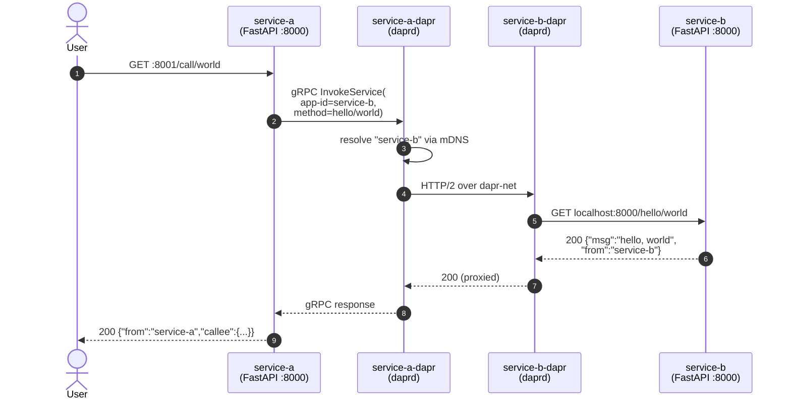
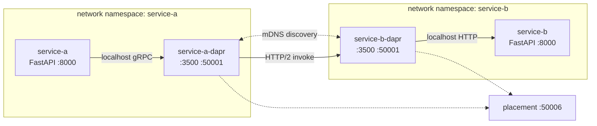

# Service Invocation

Demonstrates the Dapr **service invocation** building block: one app calls another by `app-id` through its local Dapr sidecar, without knowing the callee's host or port.

## What's running

| Container          | Role                              | Host port |
|--------------------|-----------------------------------|-----------|
| `service-a`        | FastAPI caller (Python + uv)      | `8001`    |
| `service-a-dapr`   | Dapr sidecar for service-a        | —         |
| `service-b`        | FastAPI callee (Python + uv)      | `8002`    |
| `service-b-dapr`   | Dapr sidecar for service-b        | —         |
| `placement`        | Dapr placement service (unused here, kept for parity) | — |

Each app + its sidecar share a Linux network namespace (`network_mode: "service:<app>"`), so the app reaches the sidecar at `localhost:3500` (HTTP) / `localhost:50001` (gRPC), and the sidecar reaches the app at `localhost:8000`.

Discovery between sidecars uses Dapr's default **mDNS** name resolution over the shared `dapr-net` bridge — no service registry needed.

## Flow





## How the call is wired

`service-a` (file: `service-a/app.py`)
```python
with DaprClient() as client:
    resp = client.invoke_method(
        app_id="service-b",
        method_name=f"hello/{name}",
        http_verb="GET",
    )
```

The Python SDK speaks gRPC to `localhost:50001` (the sidecar). The sidecar resolves `service-b` via mDNS, opens an HTTP/2 connection to `service-b-dapr`, which proxies the call to `service-b` at `localhost:8000/hello/{name}`.

`service-b` (file: `service-b/app.py`)
```python
@app.get("/hello/{name}")
def hello(name: str):
    return {"msg": f"hello, {name}", "from": "service-b"}
```

## Run it

```bash
make up-service-invocation        # build + start
make test-service-invocation      # curl localhost:8001/call/world
make logs-service-invocation      # follow sidecar + app logs
make down-service-invocation      # stop + remove volumes
```

## Example calls

Direct call to the caller (the Dapr path):
```bash
curl -s localhost:8001/call/world | jq
```
```json
{
  "from": "service-a",
  "callee": {
    "msg": "hello, world",
    "from": "service-b"
  }
}
```

Different name:
```bash
curl -s localhost:8001/call/alice | jq
```
```json
{
  "from": "service-a",
  "callee": {
    "msg": "hello, alice",
    "from": "service-b"
  }
}
```

Bypass Dapr — talk to service-b directly (proves the apps themselves don't know about each other; only Dapr sidecars connect them):
```bash
curl -s localhost:8002/hello/world | jq
```
```json
{"msg":"hello, world","from":"service-b"}
```

Invoke service-b through its own sidecar's HTTP API (port `3500` isn't exposed in this compose; do it from inside the container):
```bash
docker compose -f service-invocation/docker-compose.yml exec service-b \
  curl -s http://localhost:3500/v1.0/invoke/service-b/method/hello/world
```
```json
{"msg":"hello, world","from":"service-b"}
```

Health endpoints (no Dapr involved):
```bash
curl -s localhost:8001/healthz
curl -s localhost:8002/healthz
```

## Troubleshooting

- **First invocation hangs ~5–10 s** — sidecars need time to discover each other via mDNS. Subsequent calls are fast.
- **`invoke failed: ... not found`** — sidecar didn't resolve the app-id. Check `make logs-service-invocation` for the `service-b-dapr` line `dapr initialized. Status: Running. Init Elapsed ...`.
- **Port already allocated** — host port `8001`/`8002` in use; stop any prior `up-*` run or change the left side of the `ports:` mapping.
