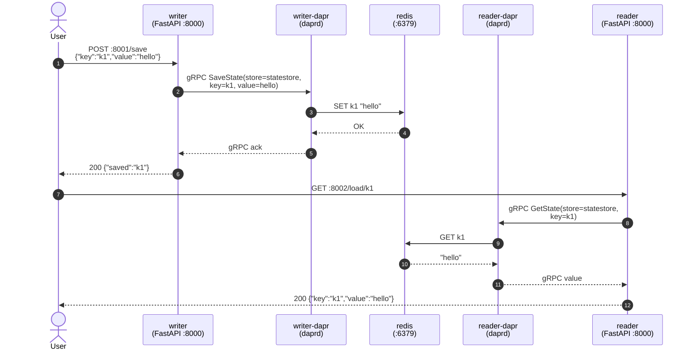
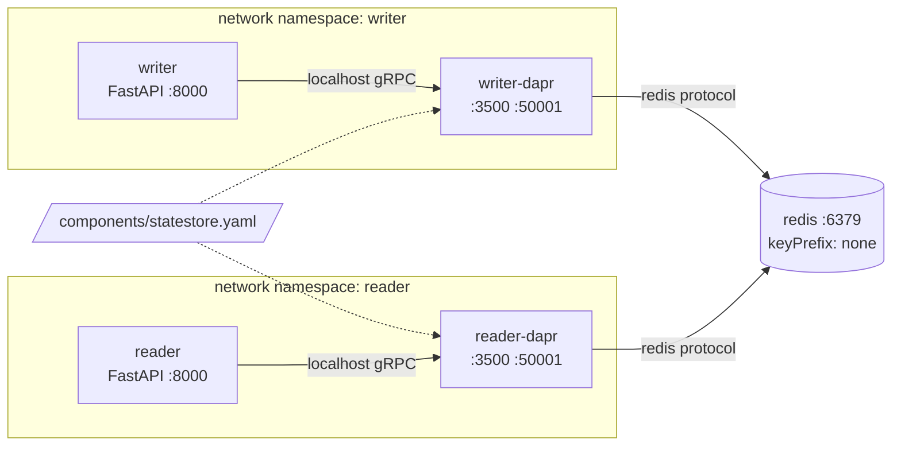

# State Management

Demonstrates the Dapr **state management** building block: two services share state through a Dapr state store component, without touching Redis (or any backend) directly. Swap `state.redis` for `state.postgresql`, `state.cosmosdb`, etc. and the app code does not change.

## Shared keyspace via `keyPrefix: none`

By default Dapr prefixes every state key with the calling app-id, so `writer` saving `k1` lands at `dapr-state-management||writer||k1`, and `reader` (a different app-id) looking up `k1` would query `dapr-state-management||reader||k1` — a different Redis key, returning `null`.

This example configures the component with **`keyPrefix: none`**, giving both services one shared keyspace. The reader sees exactly what the writer wrote, and the raw Redis key is just `k1` — no prefix.

```yaml
spec:
  type: state.redis
  metadata:
    - name: keyPrefix
      value: none
```

Every sequence diagram, Redis key, and example call below assumes this setting.

## What's running

| Container          | Role                                  | Host port |
|--------------------|---------------------------------------|-----------|
| `writer`           | FastAPI writer (Python + uv)          | `8001`    |
| `writer-dapr`      | Dapr sidecar for writer               | —         |
| `reader`           | FastAPI reader (Python + uv)          | `8002`    |
| `reader-dapr`      | Dapr sidecar for reader               | —         |
| `redis`            | Redis 8 (state backend)               | —         |
| `placement`        | Dapr placement service (parity)       | —         |

Component `statestore` (`components/statestore.yaml`) wires `state.redis` to `redis:6379` with `keyPrefix: none`. Both sidecars load it from the shared `./components` mount.

## Flow





## Component (`components/statestore.yaml`)

```yaml
apiVersion: dapr.io/v1alpha1
kind: Component
metadata:
  name: statestore
spec:
  type: state.redis
  version: v1
  metadata:
    - name: redisHost
      value: redis:6379
    - name: redisPassword
      value: ""
    - name: actorStateStore
      value: "false"
    - name: keyPrefix
      value: none
```

## How the calls are wired

`writer` (file: `writer/app.py`)
```python
with DaprClient() as client:
    client.save_state("statestore", item.key, item.value)
```

`reader` (file: `reader/app.py`)
```python
with DaprClient() as client:
    resp = client.get_state("statestore", key)
return {"key": key, "value": resp.text() or None}
```

## Run it

```bash
make up-state-management        # build + start (writer, reader, redis, placement, 2 sidecars)
make test-state-management      # POST then GET via make
make logs-state-management
make down-state-management
```

## Example calls

Save a value via the writer:
```bash
curl -s -X POST localhost:8001/save \
  -H 'content-type: application/json' \
  -d '{"key":"greeting","value":"hello dapr"}' | jq
```
```json
{"saved":"greeting"}
```

Read it back from the **reader** — different app-id, same key, because `keyPrefix: none`:
```bash
curl -s localhost:8002/load/greeting | jq
```
```json
{"key":"greeting","value":"hello dapr"}
```

Overwrite and re-read:
```bash
curl -s -X POST localhost:8001/save \
  -H 'content-type: application/json' \
  -d '{"key":"greeting","value":"updated"}'
curl -s localhost:8002/load/greeting | jq
```
```json
{"key":"greeting","value":"updated"}
```

Missing key returns `null`:
```bash
curl -s localhost:8002/load/does-not-exist | jq
```
```json
{"key":"does-not-exist","value":null}
```

Inspect the raw Redis keys — no app-id prefix:
```bash
docker compose -f state-management/docker-compose.yml exec redis redis-cli KEYS '*'
```
```
1) "greeting"
```

Call the sidecar's HTTP state API directly (from inside the writer container) — same shared keyspace:
```bash
docker compose -f state-management/docker-compose.yml exec writer \
  curl -s -X POST http://localhost:3500/v1.0/state/statestore \
  -H 'content-type: application/json' \
  -d '[{"key":"raw","value":"via http api"}]'

curl -s localhost:8002/load/raw | jq
```
```json
{"key":"raw","value":"via http api"}
```

Health endpoints:
```bash
curl -s localhost:8001/healthz
curl -s localhost:8002/healthz
```

## Troubleshooting

- **Reader returns `null` for a key the writer just saved** — sidecars cache components at start; if `statestore.yaml` was edited after `up`, restart them: `docker compose -f state-management/docker-compose.yml restart writer-dapr reader-dapr`.
- **Old keys with `appid` prefix lingering in Redis** — leftover from a previous run with default `keyPrefix`. Flush: `docker compose -f state-management/docker-compose.yml exec redis redis-cli FLUSHALL`.
- **`save failed: ...connection refused`** — `redis` container not ready yet. `depends_on` waits for start, not readiness. Wait a few seconds after `up` or re-run.
- **Port already allocated** — `8001`/`8002` collide with another running example. Run one example at a time.
