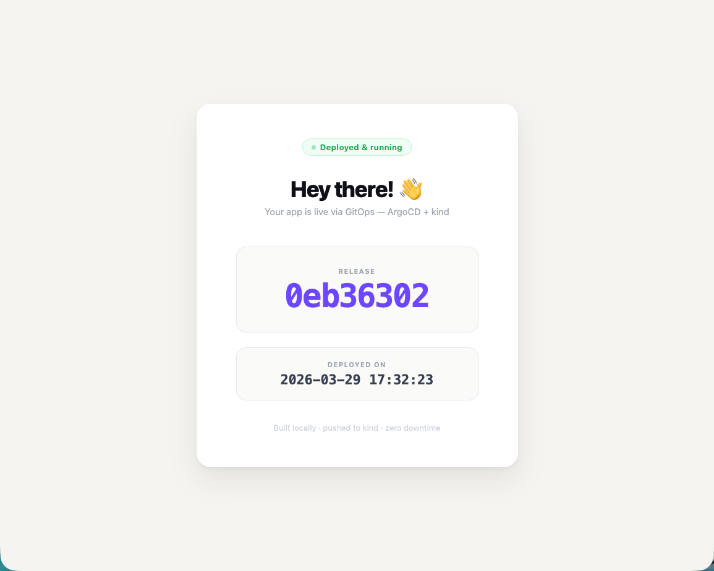
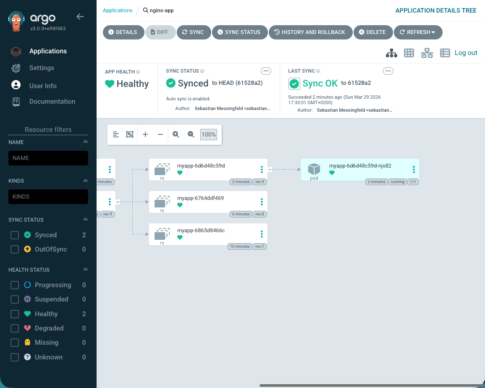
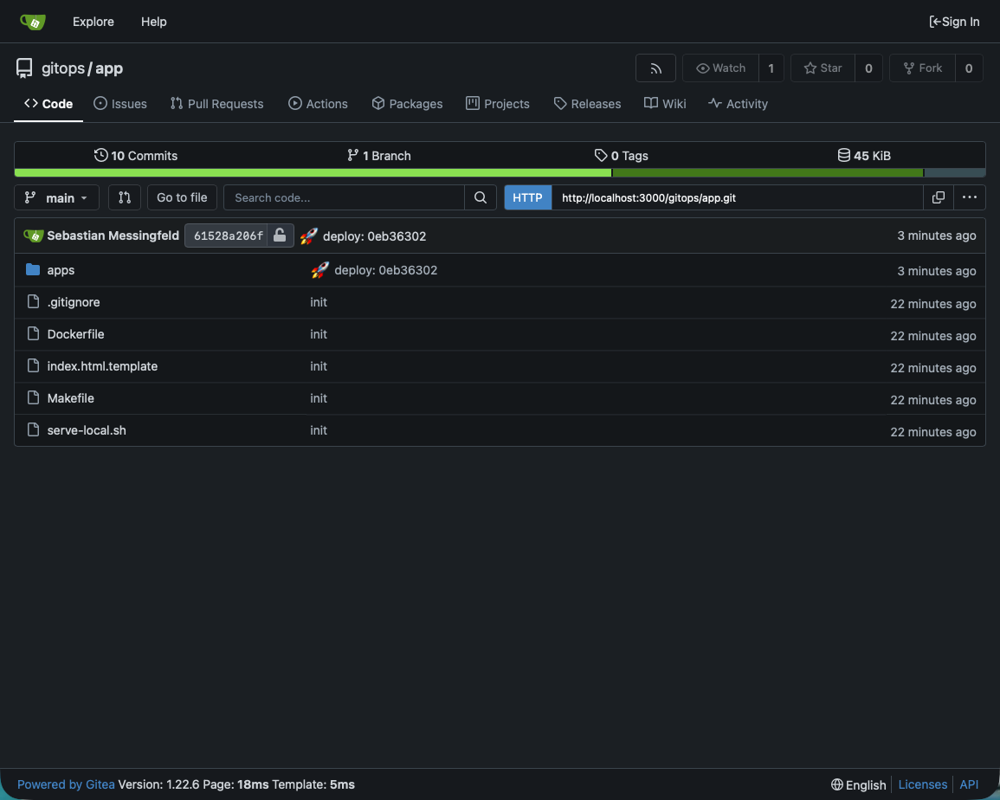

# Local Kubernetes + ArgoCD GitOps Setup

A fully local GitOps environment — no cloud, no GitHub account, no external services required. One command boots a complete cluster with ArgoCD, a local git server, and a local Docker registry. Deployments are triggered by a single `make deploy`.

## Screenshots

| App | ArgoCD | Gitea |
|-----|--------|-------|
|  |  |  |
| http://localhost:8888 | https://localhost:8080 — `admin` / `argocd-local` | http://localhost:3000 — `gitops` / `gitops` |

---

## What's included

| Component    | Purpose                                              |
|--------------|------------------------------------------------------|
| **kind**     | Local Kubernetes cluster                             |
| **ArgoCD**   | Watches the git repo and syncs changes automatically |
| **Gitea**    | Git server running inside the cluster                |
| **Registry** | Local Docker registry on `localhost:5001`            |

## The deploy loop

```
make deploy
  └─ builds Docker image → localhost:5001
  └─ patches deploy-id annotation in apps/deployment.yaml
  └─ git commit + push → Gitea (in-cluster)
  └─ triggers ArgoCD hard refresh

ArgoCD detects the new commit
  └─ applies apps/deployment.yaml
  └─ rolling update with readiness probe (zero downtime)

http://localhost:8888 — updated within seconds
```

---

## Prerequisites

- [Docker Desktop](https://www.docker.com/products/docker-desktop/) — must be running, 4 GB memory recommended
- [Homebrew](https://brew.sh) — `kind` and `kubectl` are installed automatically

---

## Usage

**Start everything**

```bash
make start
```

```
Starting local registry on port 5001...
Creating kind cluster 'local'...
Installing ArgoCD v3.0.0...
Waiting for ArgoCD pods to be ready (this takes ~1-2 min)...
Deploying Gitea...
Waiting for Gitea to be accessible...
App pushed to Gitea.
Applying ArgoCD Application...

┏━━━━━━━━━━━━━━━━━━━━━━━━━━━━━━━━━━━━━━━━━━━━━━━━━━━━━┓
┃           ✅  Cluster ready!                        ┃
┃              Running initial deploy...              ┃
┣━━━━━━━━━━━━━━━━━━━━━━━━━━━━━━━━━━━━━━━━━━━━━━━━━━━━━┫
┃  🌐 App:      http://localhost:8888                 ┃
┃  🔁 ArgoCD:   https://localhost:8080                ┃
┃     User: admin / <password>                        ┃
┃  🐙 Gitea:    http://localhost:3000                 ┃
┃     User: gitops / Pass: gitops                     ┃
┗━━━━━━━━━━━━━━━━━━━━━━━━━━━━━━━━━━━━━━━━━━━━━━━━━━━━━┛

🚀 Starting release...
   📦 Build:  a1b2c3d4
   🕐 Date:   2026-03-29 17:00:00

   ✅ Docker image built
   ✅ Image pushed → localhost:5001/myapp:latest
   ✅ deployment.yaml patched
   ✅ Committed
   ✅ Pushed to Gitea
   ✅ ArgoCD sync triggered

✨ Release a1b2c3d4 live in seconds

   🌐 http://localhost:8888
```

**Deploy a new version**

```bash
make deploy
```

```
🚀 Starting release...
   📦 Build:  7e6ca446
   🕐 Date:   2026-03-29 17:27:35

   ✅ Docker image built
   ✅ Image pushed → localhost:5001/myapp:latest
   ✅ deployment.yaml patched
   ✅ Committed
   ✅ Pushed to Gitea
   ✅ ArgoCD sync triggered

✨ Release 7e6ca446 live in seconds

   🌐 http://localhost:8888
```

**Check status**

```bash
make status
```

```
┏━━━━━━━━━━━━━━━━━━━━━━━━━━━━━━━━━━━━━━━━━━━━━━━━━━━━━┓
┃                    Status                           ┃
┣━━━━━━━━━━━━━━━━━━━━━━━━━━━━━━━━━━━━━━━━━━━━━━━━━━━━━┫
┃  🔁 ArgoCD sync:   Synced                           ┃
┃  💚 ArgoCD health: Healthy                          ┃
┃  📦 Deploy ID:     7e6ca446                         ┃
┃  🚀 Pods ready:    1 / 1                            ┃
┣━━━━━━━━━━━━━━━━━━━━━━━━━━━━━━━━━━━━━━━━━━━━━━━━━━━━━┫
┃  🌐 App:           http://localhost:8888            ┃
┃  🔁 ArgoCD UI:     https://localhost:8080           ┃
┃     User: admin / <password>                        ┃
┃  🐙 Gitea:         http://localhost:3000            ┃
┃     User: gitops / gitops                           ┃
┗━━━━━━━━━━━━━━━━━━━━━━━━━━━━━━━━━━━━━━━━━━━━━━━━━━━━━┛
```

**Tear everything down**

```bash
make teardown
```

---

## File structure

```
├── app/                        # App repo — initialized and pushed to Gitea on start
│   ├── apps/
│   │   ├── deployment.yaml     # Rolling update, readiness probe, revision cleanup
│   │   └── service.yaml        # NodePort → host port 8888
│   ├── Dockerfile              # nginx + build-arg substitution
│   ├── nginx.conf              # Cache-control headers, etag disabled
│   ├── index.html.template     # Page template with {buildnumber} / {builddate}
│   └── Makefile                # build / deploy
│
├── gitea/
│   ├── deployment.yaml         # Gitea git server pod (rootless)
│   └── service.yaml            # NodePort → host port 3000
├── argocd/
│   └── application.yaml        # ArgoCD Application — watches Gitea in-cluster
├── cluster/
│   └── kind-config.yaml        # kind cluster config, NodePort mappings, registry mirror
├── start.sh                    # Bootstrap script
├── status.sh                   # Cluster and app status
├── teardown.sh                 # Full cleanup script
└── Makefile                    # start / deploy / status / teardown
```
