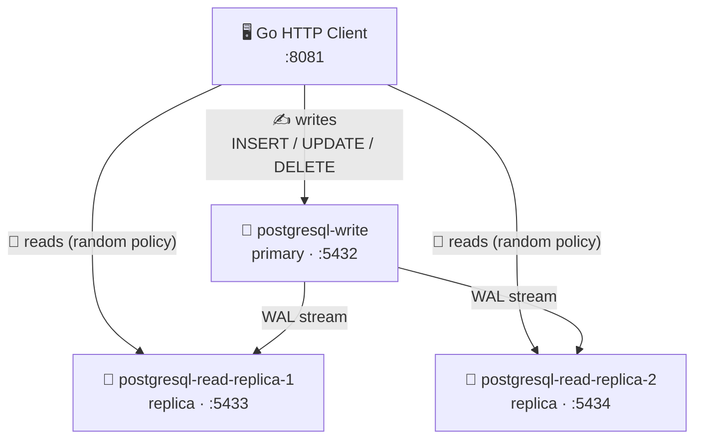

# 🐘 PostgreSQL DB Replicas

A Docker Compose example demonstrating PostgreSQL streaming replication with automatic read/write splitting in a Go HTTP service.

## 🏗️ Architecture



The ✍️ **write primary** handles all INSERT / UPDATE / DELETE operations and streams WAL (Write-Ahead Log) changes to the replicas in real time.

The 📖 **read replicas** are read-only standbys that stay in sync via streaming replication. The Go client load-balances SELECT queries across them using [GORM's dbresolver plugin](https://github.com/go-gorm/dbresolver).

## ✅ Prerequisites

- Docker + Docker Compose

## 🚀 Quick Start

Start all services (builds the client image automatically):
```bash
make compose
```

Tail logs:
```bash
make logs
```

Stop everything:
```bash
make shutdown
```

Stop and remove volumes:
```bash
make clean
```

## 📡 API Reference

Base URL: `http://localhost:8081`

| Method   | Path          | DB target     | Description         |
|----------|---------------|---------------|---------------------|
| `GET`    | `/health`     | —             | Health check        |
| `GET`    | `/users`      | Read replica  | List all users      |
| `GET`    | `/users/{id}` | Read replica  | Get a user by ID    |
| `POST`   | `/users`      | Write primary | Create a new user   |
| `DELETE` | `/users/{id}` | Write primary | Delete a user by ID |

### Examples

Health check:
```bash
curl http://localhost:8081/health
```

List all users (routed to a read replica):
```bash
curl http://localhost:8081/users
```

Get a single user (routed to a read replica):
```bash
curl http://localhost:8081/users/1
```

Create a user (routed to the write primary, replicated automatically):
```bash
curl -s -X POST http://localhost:8081/users \
  -H "Content-Type: application/json" \
  -d '{"name": "Alice"}'
```

Delete a user (routed to the write primary):
```bash
curl -X DELETE http://localhost:8081/users/1
```

## 🔍 Verify Replication

Connect to each instance to confirm writes on the primary appear on both replicas.

Write a user via the API:
```bash
curl -s -X POST http://localhost:8081/users \
  -H "Content-Type: application/json" \
  -d '{"name": "ReplicationTest"}'
```

Check the write primary:
```bash
docker exec -it postgresql-write psql -U postgres -d service -c "SELECT * FROM users;"
```

Check replica 1:
```bash
docker exec -it postgresql-read-replica-1 psql -U postgres -d service -c "SELECT * FROM users;"
```

Check replica 2:
```bash
docker exec -it postgresql-read-replica-2 psql -U postgres -d service -c "SELECT * FROM users;"
```

Check active replication slots on the primary:
```bash
docker exec -it postgresql-write psql -U postgres -c \
  "SELECT client_addr, state, sent_lsn, write_lsn, flush_lsn, replay_lsn FROM pg_stat_replication;"
```

## ⚙️ Configuration

The client is configured via environment variables (set in `compose.yml`):

| Variable         | Default     | Description                   |
|------------------|-------------|-------------------------------|
| `DB_WRITE_HOST`  | `localhost` | Hostname of the write primary |
| `DB_READ_HOST_1` | `localhost` | Hostname of read replica 1    |
| `DB_READ_HOST_2` | `localhost` | Hostname of read replica 2    |
| `DB_PORT`        | `5432`      | Port for the write primary    |
| `DB_READ_PORT_1` | `DB_PORT`   | Port for read replica 1       |
| `DB_READ_PORT_2` | `DB_PORT`   | Port for read replica 2       |
| `DB_USER`        | `postgres`  | Database user                 |
| `DB_PASSWORD`    | `postgres`  | Database password             |
| `DB_NAME`        | `service`   | Database name                 |

PostgreSQL instances are configured via `postgresql-write/.env` and `postgresql-read/.env`.
