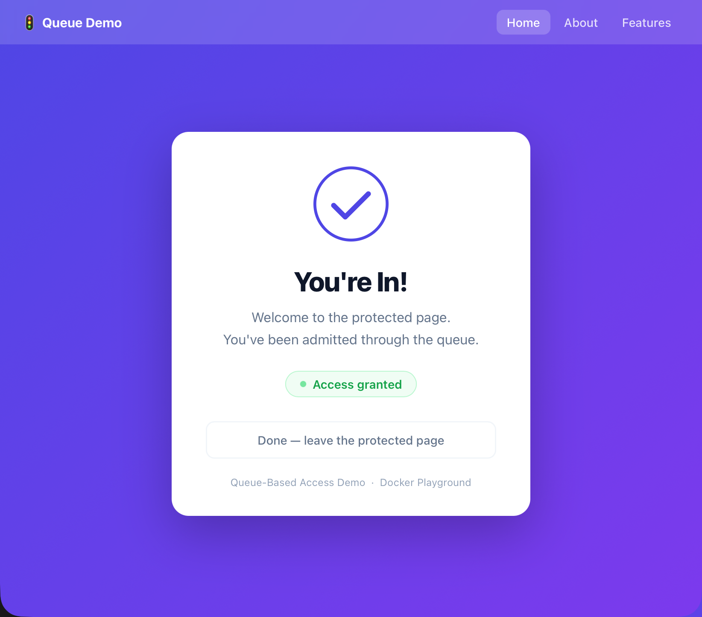
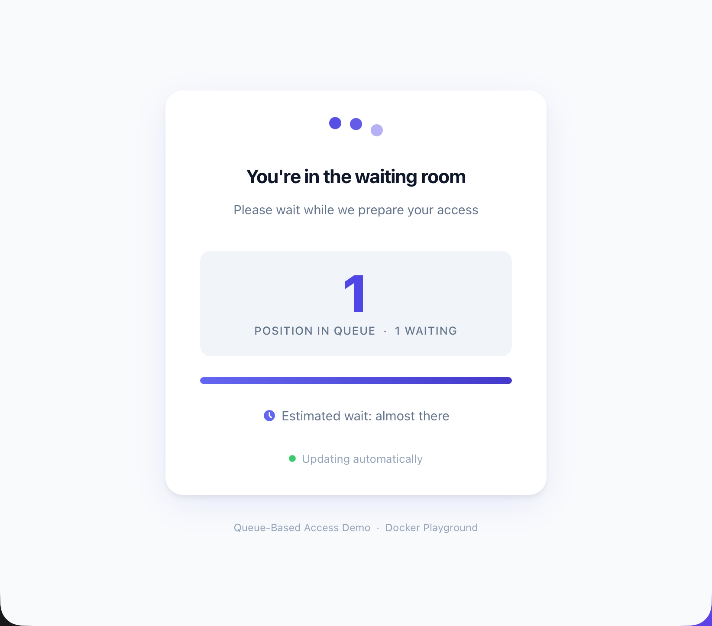
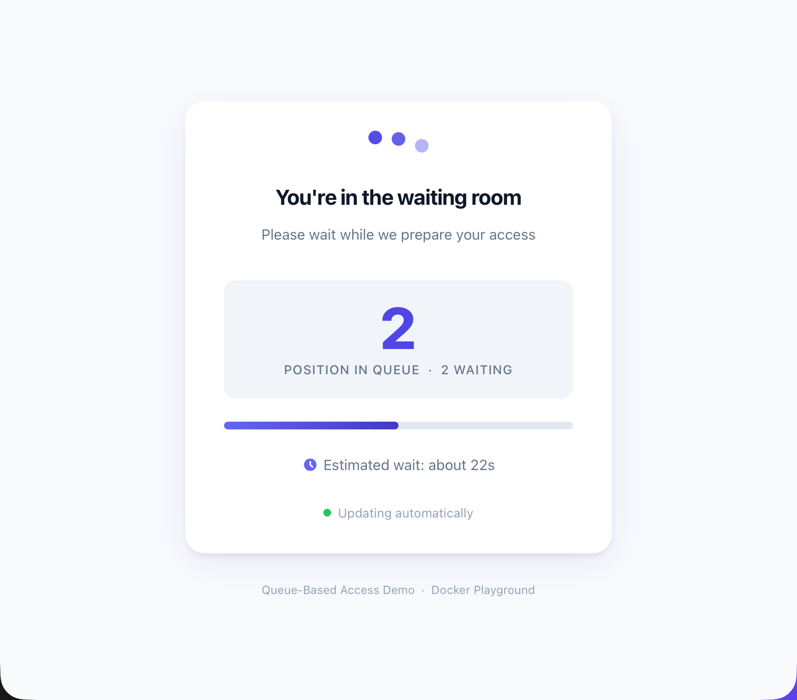

# 🚦 Queue-Based Site Access

> A production-style **virtual waiting room** built with Go, Redis, and Docker.
> Users must pass through a queue before they can reach the protected page — bypassing it is architecturally impossible.

---

| Protected page | Queue — position 1 | Queue — position 2 |
|:-:|:-:|:-:|
|  |  |  |
| Admitted users land on the protected page with a live "Access granted" indicator | First in line — position counter and progress bar update every 2 s | Further back in the queue — ETA shown once enough admission history is collected |

---

## ✨ What it does

| Scenario | Behaviour |
|----------|-----------|
| Capacity is available | User lands directly on the protected page |
| Capacity is full | User is placed in a FIFO queue and sees their live position |
| A slot opens up | The next person in line is admitted automatically |
| User tries to access the target URL directly | Redirected into the queue — no way around it |

The waiting room page updates every **2 seconds** and shows an estimated wait time once enough admission history has been collected.

---

## 🏗️ Architecture

```text
Browser  ──►  :80
               │
        ┌──────▼──────────────────-┐
        │     queue-service (Go)   │◄──► Redis
        │                          │
        │  • session gating        │
        │  • queue management      │
        │  • reverse proxy         │
        │  • admin API             │
        └──────────────────────────┘
               │  internal network only
        ┌──────▼──────────────────┐
        │   target (Nginx)        │  ← no published port
        │   protected page        │    a browser can never
        └─────────────────────────┘    reach this directly
```

| Container | Tech | Role |
|-----------|------|------|
| `queue-service` | Go | Session gating, queue logic, reverse proxy, admin API |
| `target` | Nginx | Serves the protected page — internal only |
| `redis` | Redis 7 | Stores sessions, queue list, active set, timing history |

> **Why can't users bypass the queue?**
> The `target` container has no `ports:` entry in `compose.yml`. There is no TCP path from the browser to it — every request must go through `queue-service`.

---

## 🚀 Quick start

```bash
make demo
```

Then open **<http://localhost>** in several browser tabs or incognito windows.
The first **3 sessions** (default capacity) land on the protected page — the rest land in the queue.

---

## 🛠️ Make targets

### Lifecycle

```bash
make up       # Build images and start all services
make demo     # Same as up, plus a step-by-step walkthrough
make down     # Stop and remove all containers
make logs     # Follow live logs (Ctrl+C to stop)
make ps       # Show container status
make clean    # Stop containers and remove locally built images
```

### Admin

```bash
make admin-status          # Show live queue state
make admin-capacity N=5    # Set max concurrent users to 5
make admin-release         # Free one active slot → admit next user
```

---

## 🔧 Admin API

All endpoints are on **<http://localhost>**.

### `GET /api/admin/status`

Returns a live snapshot of the queue.

```jsonc
{
  "capacity": 3,         // max concurrent users
  "active": 2,           // users currently on the protected page
  "queued": 5,           // users waiting in line
  "history_entries": 12  // admission timestamps collected (ETA kicks in at 5)
}
```

### `POST /api/admin/capacity`

Change how many users can be active at the same time.
Queued users are admitted immediately if the new limit allows it.

```bash
curl -X POST http://localhost/api/admin/capacity \
  -H "Content-Type: application/json" \
  -d '{"capacity": 5}'
```

### `POST /api/admin/release`

Evict *N* active sessions and trigger queue advancement.

```bash
curl -X POST http://localhost/api/admin/release \
  -H "Content-Type: application/json" \
  -d '{"count": 1}'
```

### `GET /health`

Service + Redis health check. Returns `{"status":"ok"}` or `503`.

---

## ⚙️ How the queue works

```
Visitor arrives at /
  │
  ├─► valid active session? ──YES──► proxied to target ✅
  │
  └─► no valid session
        │
        ├─► capacity free? ──YES──► claim slot (Lua) ──► proxied ✅
        │
        └─► at capacity
                │
                └─► join FIFO queue ──► redirect to /queue 🕐
                          │
                          └─► background worker (ticks every 1 s)
                              pops next session when slot opens
                              queue page polls every 2 s
                              on admit → redirect to / ✅
```

### ⏱️ Estimated wait time

Every admission records a Unix timestamp in Redis (capped at 100 entries).
Once **5 or more** admissions have been recorded, the ETA is calculated as:

```text
ETA = average_interval_between_admissions × (your_position − 1)
```

Until then the queue page shows *"Calculating estimated wait…"*

### 💓 Session TTL & stale-session cleanup

Every session is kept alive by a **heartbeat** that JavaScript sends every **10 seconds** from both the queue page and the protected page. The server stores a `heartbeat:{id}` key in Redis with a **30-second TTL** — so a session needs at most three missed pings before it is considered abandoned.

A background reaper runs every **5 seconds** and evicts any session whose heartbeat key has expired:

```
Heartbeat ping every 10 s
        │
        └─► server refreshes heartbeat:{id} TTL to 30 s
                │
                └─► reaper ticks every 5 s
                    checks every active + queued session
                    if heartbeat:{id} is missing → evict
                    then immediately admits next queued user
```

**What happens in each scenario:**

| Scenario | Result |
|----------|--------|
| User on protected page closes tab | Heartbeat stops → reaper evicts within ~35 s |
| User on protected page loses connection | Heartbeat stops → reaper evicts within ~35 s |
| User on protected page **refreshes** | Heartbeat resumes on reload → **slot preserved** |
| User **navigates to a subpage** | Active session: all paths proxied → **slot preserved** |
| User on queue page closes tab | Heartbeat stops → reaper evicts within ~35 s |
| User on queue page **refreshes** | Heartbeat resumes on reload → **position preserved** |

> **Why no beacon on the queue page?**
> `pagehide` fires on both tab-close *and* page-refresh. A beacon here would evict the session on every refresh, bumping the user to the back of the queue. The heartbeat/reaper pair handles cleanup without that side-effect.

### 🔒 Race condition safety

All slot claims and queue pops are **atomic Redis Lua scripts**.
Two concurrent requests cannot both claim the same last slot — the check and the write happen in a single atomic operation on the Redis server.

---

## 🗂️ Project structure

```
queue-based-site-access/
├── compose.yml                       Docker Compose — 3 services on an isolated network
├── Makefile                          All operations: up, down, logs, admin
│
├── queue-service/                    Go service (the brain)
│   ├── main.go                       Wiring: Redis, proxy, worker, HTTP server
│   ├── go.mod / go.sum
│   ├── Dockerfile                    Multi-stage build → minimal Alpine image
│   │
│   ├── internal/
│   │   ├── config/
│   │   │   └── config.go             Config struct + env loading
│   │   │
│   │   ├── queue/
│   │   │   ├── store.go              Store struct, public API (admit, join, leave, ETA…)
│   │   │   ├── scripts.go            Atomic Redis Lua scripts
│   │   │   └── worker.go             Background worker: admit loop + stale-session reaper
│   │   │
│   │   └── handler/
│   │       ├── handler.go            Handler struct, route registration, shared helpers
│   │       ├── gate.go               rootHandler, queuePageHandler, positionHandler
│   │       ├── session.go            Heartbeat + leave handlers (called by JS on pagehide)
│   │       └── admin.go              Admin handlers: capacity, release, status
│   │
│   └── web/
│       ├── queue.html                Waiting room page
│       └── static/
│           ├── styles.css            Queue page styles
│           └── app.js                2 s polling, heartbeat ping, auto-redirect on admit
│
└── target/                           Protected destination
    ├── Dockerfile                    nginx:alpine — no published port
    ├── nginx.conf
    └── html/
        ├── index.html                "You're In!" home page
        ├── about.html                About page (subpage demo)
        ├── features.html             Features page (subpage demo)
        └── styles.css                Shared styles incl. top nav
```

---

## 🔑 Configuration

All values are environment variables on `queue-service` (see `compose.yml`).

| Variable | Default | Description |
|----------|---------|-------------|
| `REDIS_ADDR` | `redis:6379` | Redis connection address |
| `TARGET_URL` | `http://target:80` | Internal URL of the protected service |
| `QUEUE_CAPACITY` | `3` | Initial max concurrent users — persists in Redis across restarts |
| `PORT` | `8080` | Port the queue-service listens on |
| `WEB_DIR` | `/web` | Path to `queue.html` and `static/` assets |

---

## 📝 Production notes

- 🔐 **Signed cookies** — Replace the plain UUID `qsid` cookie with an HMAC-signed value to prevent forgery.
- 💓 **Heartbeat TTL** — Already implemented: sessions ping every 10 s, reaper evicts stale ones every 5 s. Tune `heartbeatTTL` in `store.go` for stricter or more lenient timeouts.
- 📡 **Real-time updates** — Replace the 2s polling with Server-Sent Events or WebSockets for instant queue advancement.
- 🌐 **TLS** — Place a TLS-terminating reverse proxy (e.g. Traefik) in front of `queue-service` in any public deployment.
